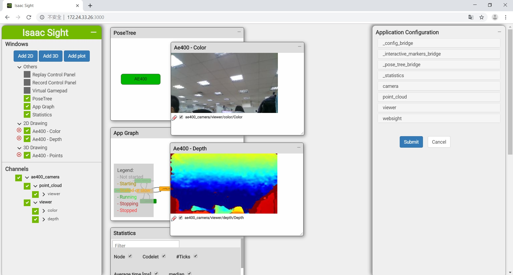

## PREREQUISITE:

1. Prepare a Ubuntu 18.04 x64 desktop equipped with a NVIDIA video card that supports CUDA.

2. Install dependencies of desktop/Bazel/NVIDIA GPU Driver according to the following document:
  
  https://docs.nvidia.com/isaac/isaac/doc/setup.html#prerequisites

3. Download latest NVIDIA Isaac SDK from the following website:

  https://developer.nvidia.com/isaac/downloads

  Currently, latest release is Isaac 2019.2 (file name isaac-sdk-2019.2-30e21124.tar.xz). Download and save it to the folder ~/Downloads

4. git clone the LIPS stereo_ae400 workspace by the following commands:
```
$ cd ~/Download
$ git clone https://github.com/lips-hci/stereo_ae400.git
```

#### Read More:

1. How to switch between Intel and NVIDIA video cards on Ubuntu?
   
   https://www.linuxbabe.com/desktop-linux/switch-intel-nvidia-graphics-card-ubuntu
      
2. If you want to install CUDA 10.0 manually, you can refer this one-click-install script.
   
   https://gist.github.com/bogdan-kulynych/f64eb148eeef9696c70d485a76e42c3a

## To build support for AE400 camera on Isaac SDK:

1. create a folder named 'issac' under ~/Downloads and untar the Isaac SDK into it
```
  $ mkdir -p ~/Downloads/isaac
  $ cd ~/Downloads
  $ tar Jxvpf isaac-sdk-2019.2-30e21124.tar.xz -C isaac
```

2. modify the path in the WORKSPACE under the stereo_ae400 folder.
```
  local_repository(
      name = "com_nvidia_isaac",
      path = "/home/jsm/Downloads/isaac", # Here to sepcify your Issac SDK location, e.g. ~/Downloads/issac
  )
```

3. build the app under stereo_ae400 folder.
```
  $ cd ~/Downloads/stereo_ae400
  $ bazel build //app/ae400_camera
```
  note: make sure your host can access to Internet, or you will get build errors

4. (optional) tell server the IP address of the AE400 camera, default setting is 192.168.0.100

 - You can assign new IP address through browser,
  
  open a web browser and input http://192.168.0.100/

  you will see the online configuration page. Log in and change the IP address you want.

 - or you can edit the configuration file on your host,
```
  $ sudo mkdir -p /usr/etc/LIPS/lib
  $ sudo cp /config/network.json /usr/etc/LIPS/lib/
  $ vi /usr/etc/LIPS/lib/network.json  //assign the IP address you want
```
  note: If you have set IP address in the file network.json, it will be used first.
  
  otherwise, AE400 will use default IP address (192.168.0.100)

5. run the app on desktop.
```
  $ bazel run //app/ae400_camera
```

  note: make sure the host, AE400, and remote robot are at the same network domain, so they can connect to each other.

 - Open a web brower, connect to http://localhost:3000
 - From left panel, select ae400_camera checkbox to enable depth/color channels for streaming.
 
 

### Deploy and run the app remotely (optional)

1. deploy the app to Jetson Nano(robot) remotely if you have one.

  note: if you need Jetson TX2 support, please contact us.

  Use below command on your host side.
```
  # deplay.sh --remote_user <username_on_robot>
               -p //app/ae400_camera:ae400_camera-pkg
               -d jetpack42
               -h <robot_ip>
               -u <insatll_home_name_you_want>
```
  For example:
```
$ ./deploy.sh --remote_user lips -p //app/ae400_camera:ae400_camera-pkg -d jetpack42 -h 192.168.0.100 -u dt
```

2. run the app remotely on the robot.

host side:

 - Make sure you have an SSH key on your desktop machine.
   ```
    $ ssh-keygen
    $ ssh-copy-id <username_on_robot>@<robot_ip>
    ```
   note: if you did commands above, you won't input password when you connect to robot by ssh

 - Run the app
 ```
  $ ssh ROBOTUSER@ROBOTIP
  $ cd ~/deploy/<install_home_name_you_want>/ae400_camera-pkg
  $ ./app/ae400_camera/ae400_camera
```
 - Open a web brower, connect to http://<robot_ip>:3000
 - From left panel, select ae400_camera checkbox to enable depth/color channels for streaming.

8. Enjoy!
